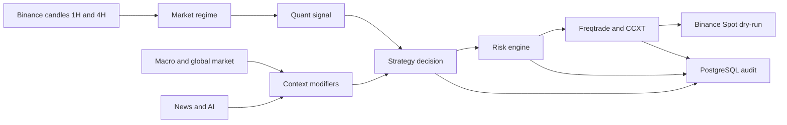

# Roadmap Pasca-MVP: Quant-first, Context-aware Trading Bot

## Tujuan

Membangun bot Binance Spot yang mengambil keputusan melalui lapisan terpisah dan dapat diaudit:



Quant dan risk engine tetap deterministik. AI hanya mengklasifikasi konteks berita dan sentimen dalam JSON terstruktur; AI tidak menentukan ukuran posisi, stop-loss, take-profit, atau mengirim order.

## Prinsip yang tidak berubah

- Binance Spot, long-only, BTC/USDT dan ETH/USDT pada fase awal.
- Candle 1H untuk entry dan 4H untuk market regime.
- Freqtrade adalah pemilik lifecycle order, dry-run, backtest, dan database trade internal.
- PostgreSQL aplikasi menyimpan audit keputusan domain; Redis menyimpan status cepat dan kill-switch.
- Semua provider berada di balik adapter agar OpenAI, Gemini, DeepSeek, CoinGecko, FRED, atau news provider dapat diganti tanpa mengubah strategy/risk core.
- Setiap parameter strategi dipilih lewat data train/validation/out-of-sample dan walk-forward testing, bukan hasil satu backtest atau optimisasi massal.

## Fase 0 — Foundation MVP

**Status: selesai secara operasional.** Docker, PostgreSQL, Redis, FastAPI, dan Freqtrade dry-run sudah terhubung. API dapat membaca status Freqtrade dan bot hanya menggunakan saldo virtual.

**Temuan yang menjadi gate:** baseline 180 hari bernilai -6.00%; ETH/USDT menyumbang mayoritas kerugian (-6.01%, profit factor 0.18). Strategi saat ini tidak boleh dinaikkan ke live trading dan belum layak untuk observasi dry-run jangka panjang.

## Fase 1 — Validasi dan perbaikan quant strategy

**Tujuan:** memperoleh strategi quant yang melewati threshold risiko minimum tanpa mengandalkan AI atau data eksternal.

1. Pisahkan evaluasi BTC dan ETH; ETH diuji sebagai masalah terpisah karena karakter loss-nya berbeda.
2. Buat eksperimen kecil dan terdokumentasi pada satu variabel setiap kali, dimulai dari filter regime 4H dan filter entry 1H. Contoh: threshold ADX, batas volatilitas ATR, atau konfirmasi volume.
3. Gunakan data lebih panjang, lalu bagi menjadi development, validation, dan out-of-sample. Jalankan walk-forward analysis setelah kandidat parameter terbentuk.
4. Jalankan look-ahead analysis dan pastikan fee serta slippage konservatif tetap digunakan.
5. Catat tiap eksperimen: commit strategi, periode data, parameter, jumlah trade, profit factor, expectancy, maximum drawdown, dan hasil out-of-sample.

**Selesai bila:** kandidat menghasilkan positive expectancy dan profit factor di atas 1 pada validation dan out-of-sample, drawdown berada di bawah batas yang disepakati, dan tidak bergantung pada satu pair atau satu periode pasar. Nilai target final ditetapkan setelah kita melihat rentang metrik dari eksperimen; jangan dipaksakan dari awal.

**Progress:** data 3 tahun telah dikumpulkan dan baseline multi-periode dicatat di `docs/quant-validation.md`. Baseline ditolak karena development dan out-of-sample masih negatif; eksperimen terkontrol pertama adalah strength filter 4H.

## Fase 2 — Audit trail dan kontrol operasional

**Tujuan:** setiap keputusan dapat dijelaskan dan bot bisa dihentikan dengan aman.

1. Tambahkan event adapter dari Freqtrade ke FastAPI untuk entry candidate, risk rejection, order opened, partial exit, stop-loss, take-profit, dan protection trigger.
2. Simpan snapshot indikator, regime, alasan signal, input risk, dan outcome ke PostgreSQL.
3. Implementasikan kill-switch Redis yang diperiksa sebelum entry baru, serta endpoint lokal untuk pause/resume yang memanggil API Freqtrade dengan audit event.
4. Tambahkan health/readiness checks untuk koneksi PostgreSQL, Redis, Freqtrade, dan Binance public market data.
5. Buat retention policy untuk audit dan log agar volume data terkendali.

**Progress:** lifecycle webhook Freqtrade untuk status bot, entry, exit, fill, dan cancellation sudah dikirim ke FastAPI internal dan disimpan pada PostgreSQL. Event kandidat signal, risk rejection, protection trigger, dan alasan HOLD tetap menjadi pekerjaan berikutnya.

**Selesai bila:** satu trade dry-run dapat ditelusuri dari candle kandidat sampai exit, termasuk alasan bot memilih HOLD atau menolak trade.

## Fase 3 — Data adapters: global market dan macro

**Tujuan:** menambahkan konteks pasar dengan cache dan jadwal yang sesuai, tanpa mengubah trigger quant menjadi tidak deterministik.

1. Implementasikan adapter CoinGecko untuk global market cap, market volume, BTC dominance, dan perubahan harian.
2. Implementasikan adapter FRED untuk seri yang benar-benar digunakan: Federal Funds Rate, CPI/Core PCE, US 2Y/10Y yields, serta unemployment bila relevan.
3. Normalisasi data ke model internal dan cache menurut frekuensi publikasinya; macro tidak dipoll setiap candle.
4. Klasifikasikan context menjadi `RISK_ON`, `NEUTRAL`, atau `RISK_OFF`, dengan alasan dan timestamp sumber.
5. Terapkan sebagai risk modifier terlebih dahulu: misalnya conflict macro dapat menurunkan risk per trade, tetapi belum menjadi trigger BUY/SELL absolut.

**Selesai bila:** kegagalan provider tidak menghentikan bot, data kedaluwarsa terlihat jelas, dan setiap modifier dapat direproduksi dari data yang tersimpan.

## Fase 4 — News pipeline dan AI dalam shadow mode

**Tujuan:** menguji nilai tambah AI tanpa memberi pengaruh terhadap order.

1. Pilih satu news provider dan bangun collector, deduplicator, serta event classifier.
2. Buat interface provider AI yang mendukung OpenAI, Gemini, dan DeepSeek; setiap provider mengembalikan schema JSON yang sama.
3. Panggil AI secara event-driven saja: ketika quant score melewati ambang, regime berubah, macro baru diterbitkan, volatilitas melonjak, atau ada berita penting.
4. Simpan output AI: bias, confidence, event impact, risk level, sumber/ringkasan, model, prompt version, dan biaya/token bila tersedia.
5. Jalankan dalam shadow mode: AI memberi rekomendasi yang dicatat, tetapi strategy engine dan Freqtrade mengabaikannya untuk eksekusi.

Contoh output yang dibatasi:

```json
{
  "market_bias": "bullish",
  "confidence": 0.74,
  "macro_alignment": "positive",
  "risk_level": "medium",
  "trade_support": true,
  "event_summary": "..."
}
```

**Selesai bila:** output tervalidasi terhadap schema, provider dapat diganti lewat konfigurasi, biaya per event berada dalam anggaran, dan laporan menunjukkan apakah AI memperbaiki atau justru memperburuk kandidat quant.

## Fase 5 — Context-aware strategy dalam shadow mode

**Tujuan:** mengukur fusion scoring sebelum mengizinkannya memodifikasi transaksi.

1. Bentuk skor terpisah: technical/quant, macro, global market, dan AI/news.
2. Jadikan technical score sebagai syarat minimum kandidat. Context hanya dapat memperkuat, melemahkan, atau menolak kandidat.
3. Tambahkan aturan konflik: perbedaan besar antara technical dan AI menghasilkan `HOLD`; conflict macro mengurangi risk, bukan menaikkan risk.
4. Bandingkan tiga seri hasil: quant-only, quant + macro/global, dan quant + macro/global + AI.
5. Uji out-of-sample dan walk-forward untuk setiap seri; jangan memilih konfigurasi berdasarkan data yang digunakan untuk tuning.

**Selesai bila:** context-aware variant memperbaiki metrik risiko secara konsisten dibanding quant-only dan tidak meningkatkan frequency trade hanya karena tersedia data tambahan.

## Fase 6 — Dashboard operator

**Tujuan:** memberi antarmuka Next.js yang menjelaskan kondisi bot tanpa menjadi sumber keputusan trading.

1. Hubungkan `apps/web` ke endpoint FastAPI yang sudah stabil.
2. Tampilkan status: mode dry-run, kill-switch, saldo virtual, open trades, protection/cooldown, dan kesehatan provider.
3. Tampilkan decision timeline yang membedakan `BUY CANDIDATE`, `HOLD`, `RISK REJECTED`, `OPEN`, dan `CLOSED`.
4. Tampilkan alasan: indikator ringkas, regime, risk/reward, ukuran risiko, context macro/global, dan AI shadow output.
5. Tambahkan kontrol lokal berautentikasi untuk pause/resume dan emergency stop; jangan menaruh credential exchange di browser.

**Selesai bila:** operator dapat menjawab “mengapa bot tidak membeli?” dan “mengapa posisi ditutup?” dari dashboard tanpa membuka log container.

## Fase 7 — Extended dry-run dan acceptance test

**Tujuan:** menguji reliabilitas sistem pada data berjalan setelah strategi lolos evaluasi historis.

1. Jalankan kandidat yang sudah lolos selama beberapa minggu dengan saldo virtual tetap.
2. Bandingkan hasil dry-run dengan ekspektasi backtest dan selisih harga/order fill yang realistis.
3. Uji restart container, kegagalan Redis/PostgreSQL, kegagalan provider data, API rate limit, network interruption, dan kill-switch.
4. Pantau drawdown, protection trigger, keputusan HOLD, serta perbedaan antara AI shadow dan keputusan quant.
5. Tetapkan release checklist dengan owner yang menyetujui perubahan strategi/configuration.

**Selesai bila:** tidak ada order nyata, semua kejadian operasional pulih atau masuk kondisi aman, audit lengkap, dan hasil dry-run sejalan dengan batas risiko yang telah disetujui.

## Fase 8 — Live trading terbatas (keputusan terpisah)

Fase ini tidak otomatis dimulai setelah dry-run. Jika disetujui kemudian, mulai dengan API key Binance yang hanya memiliki permission Spot Trading, tanpa withdrawal, IP allowlist, nominal kecil, dan kill-switch yang sudah teruji. Tidak ada futures, leverage, atau penambahan pair sebelum hasilnya direview.

## Urutan implementasi berikutnya

Pekerjaan berikut yang paling bernilai adalah **Fase 1**: membuat framework eksperimen quant dan memperbaiki/menolak konfigurasi ETH serta BTC berdasarkan hasil validation dan out-of-sample. Fase 2 dapat dimulai paralel setelah kandidat quant tidak lagi negatif, karena audit trail akan dibutuhkan sebelum observasi dry-run jangka panjang. Provider API AI, FRED, CoinGecko, dan news tetap disiapkan dalam `.env`, tetapi tidak diaktifkan sampai Fase 3 dan Fase 4.
